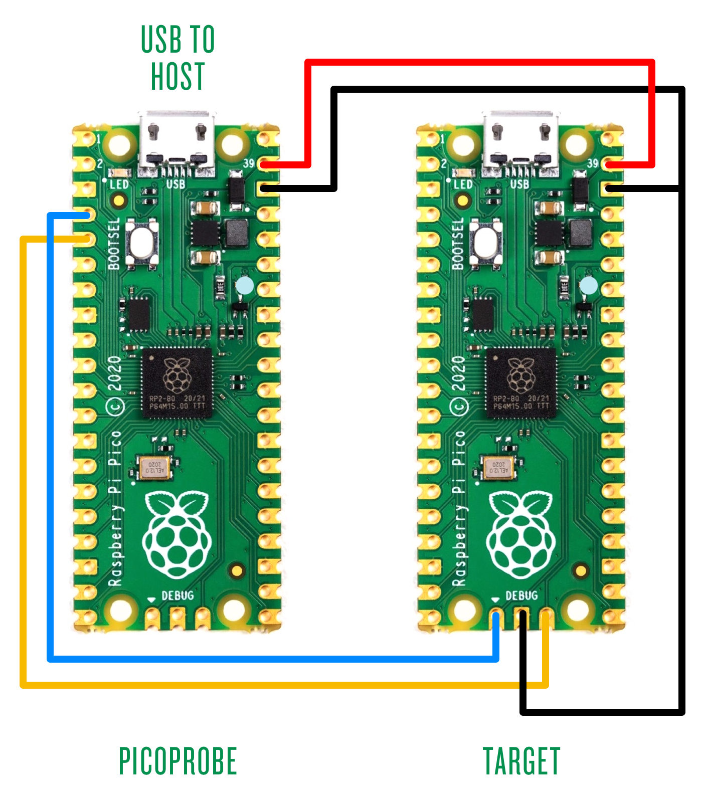

# PICO(rp2040) motor control via micro-ROS

## Prepare

### Hardware

- [Pi Pico](https://www.raspberrypi.com/products/raspberry-pi-pico/)
- [L298N motor Driver](https://lastminuteengineers.com/l298n-dc-stepper-driver-arduino-tutorial/)

### Connect Solution

- Encoder

    - GPIO 10
    - GPIO 11

- PWM for L298N motor control
    
    - GPIO 6
    - GPIO 7
    - GPIO 8
    - GPIO 9

- PWM for Servo control
  
    - GPIO 5

## Getting Started

[Detailed Tutorial](https://me.w0x7ce.eu/rp2040/micro-ROS-on-RP2040)

```bash
git clone https://github.com/tianrking/MicroROS_RP2040 ~/MicroROS_RP2040
```

## Dependencies

First, make sure the Pico SDK is properly installed and configured:

```bash
# Install dependencies
sudo apt install cmake g++ gcc-arm-none-eabi doxygen libnewlib-arm-none-eabi git python3
git clone --recurse-submodules https://github.com/raspberrypi/pico-sdk.git $HOME/pico-sdk

# Configure environment
echo "export PICO_SDK_PATH=$HOME/pico-sdk" >> ~/.bashrc
source ~/.bashrc

```

Second, make sure microros [freeRTOS](https://github.com/tianrking/RP2040_FreeRTOS) and pico-example have configured 

```bash
git clone https://github.com/micro-ROS/micro_ros_raspberrypi_pico_sdk ~/micro_ROS_SDK_PATH
echo "export micro_ROS_SDK_PATH=~/micro_ROS_SDK_PATH" >> ~/.bashrc

git clone https://github.com/raspberrypi/pico-examples ~/pico-examples
echo "export pico_examples_PATH=~/pico-examples" >> ~/.bashrc
source ~/.bashrc
```

## Build

```bash
cd ~/MicroROS_RP2040
mkdir build
cd build
cmake ..
make
```

## Flash 

To flash, hold the boot button, plug the USB and run:

```bash
cp pico_micro_ros_motor_control.uf2 /media/$USER/RPI-RP2
```

## Start Micro-ROS Agent

Micro-ROS follows the client-server architecture, so you need to start the Micro-ROS Agent.
You can do so using the [micro-ros-agent Docker](https://hub.docker.com/r/microros/micro-ros-agent):
```bash
docker run -it --rm -v /dev:/dev --privileged --net=host microros/micro-ros-agent:humble serial --dev /dev/ttyACM0 -b 115200
```

## Remote Control

### RCLPY

#### Configure

```bash
cd ~/1_ros/PC_Control/src
ros2 pkg create motor_control_rclcpp  --build-type ament_python --dependencies rclpy
```

```bash
cd example_topic_rclpy/example_topic_rclpy
touch topic_subscribe_02.py
touch topic_publisher_02.py
```

```bash
cd ~/1_ros/PC_Control/
colcon build
source install/setup.bash
```

#### RUN

```bash
ros2 run motor_control_rclpy change_speed
ros2 run motor_control_rclpy get_speed
```

### RCLCPP

Todo


### PySide6 GUI Control

```bash
git clone https://github.com/tianrking/1_ros -b GUI Pico_Control
cd Pico_Control
pip install PySide6
source /opt/ros/humble/setup.bash
python3 main.py
```

## Debug

### Build and Upload Picoprobe

```bash
git clone https://github.com/raspberrypi/picoprobe
cd picoprobe
git submodule update --init --recursive
mkdir build
cd build
cmake -G "Unix Makefiles" ..
make
cp picoprobe.uf2 /media/${USER}/RPI-RP2
```

### Flash 

#### build openocd

```bash
sudo apt install libhidapi-dev -y
```

```bash
cd ~/pico
sudo apt install automake autoconf build-essential texinfo libtool libftdi-dev libusb-1.0-0-dev
git clone https://github.com/raspberrypi/openocd.git --depth=1 
cd openocd
./bootstrap
./configure --enable-picoprobe --enable-cmsis-dap --enable-jlink --enable-stlink --enable-ti-icdi
make -j4
sudo make install
```

#### Flash elf

```bash
openocd -f interface/picoprobe.cfg -f target/rp2040.cfg -c "program blink/blink.elf  verify reset exit"
```

bug

```bash
openocd -f interface/cmsis-dap.cfg -c "transport select swd" -c "adapter_khz 500" -f target/rp2040.cfg -c "program blink/blink.elf  verify reset exit"
```

### GDB



Shell A

```bash
openocd -f interface/picoprobe.cfg -f target/rp2040.cfg
```

Shell B

```bash
gdb-multiarch blink/blink.elf
```

```bash
target remote localhost:3333
monitor reset init
continue

flash probe 0
flash erase_sector 0 0 last
```
